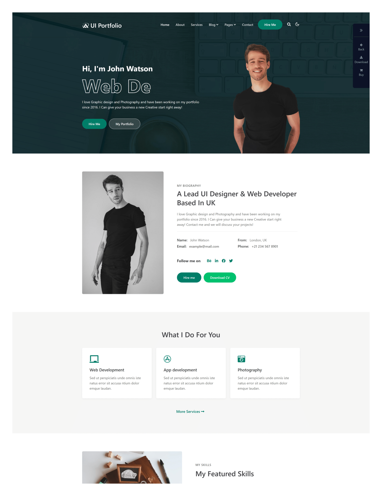

# UI Portfolio Website

A modern, responsive portfolio website with dark/light mode toggle, animations, and interactive elements.

**Portfolio Website Preview**
.png>).jpg>)

Inspired by [ https://wp.w3layouts.com/ui-portfolio/ ]

## Overview

This project is a responsive portfolio website template designed for UI/UX designers, web developers, and creative professionals. It features a modern design with interactive elements, animations, and a dark/light mode toggle.

## Features

- **Responsive Design**: Fully responsive layout that works on all devices
- **Dark/Light Mode Toggle**: User preference is saved in localStorage
- **Animated Typing Effect**: Dynamic text animation in the hero section
- **Sticky Header**: Header changes appearance on scroll
- **Skills Progress Bars**: Animated progress bars to showcase skills
- **Portfolio Gallery**: Filterable portfolio items
- **Contact Form**: Ready-to-use contact form (requires backend implementation)
- **Smooth Animations**: Various hover effects and transitions
- **Modern UI**: Clean and professional design

## Technologies Used

- HTML5
- CSS3 (with Flexbox and Grid)
- Vanilla JavaScript
- Font Awesome Icons
- Google Fonts

## Solution Approach

### Structure and Organization

The project follows a modular approach with separate files for HTML, CSS, and JavaScript:

- `index.html`: Main HTML structure
- `styles.css`: All styling with responsive design
- `script.js`: JavaScript functionality

### Key Implementation Details

1. **Theme Switching**:
   - Implemented using CSS classes and JavaScript
   - User preference stored in localStorage
   - Smooth transitions between themes

2. **Typing Effect**:
   - Created using pure JavaScript
   - Cycles through multiple phrases
   - Customizable typing and deletion speeds

3. **Sticky Header**:
   - Changes from transparent to solid on scroll
   - Implemented with scroll event listeners
   - Smooth transition effect

4. **Skills Section**:
   - Progress bars with percentage indicators
   - Animation triggered when scrolled into view
   - Visual representation of skill levels

5. **Responsive Design**:
   - Mobile-first approach
   - Breakpoints for different screen sizes
   - Flexible layouts using CSS Grid and Flexbox

## Setup and Usage

1. Clone the repository:
   \`\`\`
   git clone https://github.com/KabeloMatlakala/PLP-UI-Portfolio.git
   \`\`\`

2. Open the project folder:
   \`\`\`
   cd ui-portfolio
   \`\`\`

3. Open `index.html` in your browser or use a local development server.

## Customization

### Changing Content

- Update text in the HTML file
- Replace images in the portfolio section
- Modify skill percentages in the skills section

### Styling Changes

- Color scheme can be modified in the CSS variables
- Font styles can be changed in the CSS file
- Layout adjustments can be made in the responsive media queries

### Adding New Sections

1. Create the HTML markup for your new section
2. Add corresponding CSS styles
3. Add any JavaScript functionality if needed

## Future Enhancements

- Add portfolio filtering functionality
- Implement testimonial slider
- Add form validation and submission
- Convert to a Next.js or React project
- Add blog section with CMS integration

## License

This project is licensed under the MIT License - see the LICENSE file for details.

## Acknowledgments

- Font Awesome for icons
- Google Fonts for typography
- Freepik for stock images
